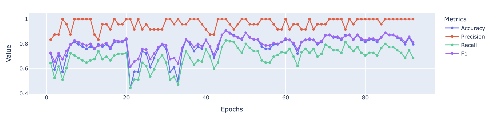
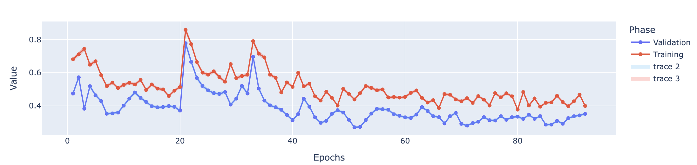

# Stem Cells Toolkit (SWE4S - Group 5 Project)

Welcome to the Stem Cells (SC) Toolkit repo! <br>
We aim to develop for the analysis of stem cells. Currently, we are working on developing three tools: <br>
1. A machine learning model that classifies images of stem cell colonies based on their differentiation (whether they retain their cell identity or they have become other cell type)
2. Cell segmentation tool for DAPI staining (nucelar staining) using [CellPose 2.0](https://www.cellpose.org/)
3. A combined segmentation and machine learning model that segments stem cell colonies based on individual cells and classifies them based on their quality (similar to tool # 1)

## Tool #1: Stem Cell Colony Classification

The goal is to train a machine learning (ML) model that takes in images of induced pluoripotent stem cells (iPSC) colonies and classifies their status based on their differentiation (type of cell they are)

### Approach
1. **Dataset**: Label dataset of iPSC images categorized by health (contamination and differentiation) status.
   - Publically availible data was used for training from: (Mamaeva et al 2022)
   - This data is in the repository directory entitled `model_data`
   - All data files are 256 x 256 png images and can be used for testing modules. 
      
2. **Preprocessing**: Standardize image sizes, normalize pixel values, and augment dataset to avoid overfitting. Image inputs currently accepted are 256 x 256 pixel png images. 
 - The image preprocessing steps have been tested with this model: 
    - graylevel transform
    - binarization 
    - normalization 
   - histogram equalization

3. **Model**: 
 - An existing convolutional neural network was trained using publically availible data for the classification of iPSC colonies as healthy or unhealthy. Training was allowed to continue for ~ 80 epochs and 25% of data was witheld and used for validating the model. 
 - This model has been published: Mamaeva, A.; Krasnova, O.; Khvorova, I.; Kozlov, K.; Gursky, V.; Samsonova, M.; Tikhonova, O.; Neganova, I. Quality Control of Human Pluripotent Stem Cell Colonies by Computational Image Analysis Using Convolutional Neural Networks. Int. J. Mol. Sci. 2023, 24, 140. https://doi.org/10.3390/ijms24010140
    
   - Model metrics after initial training: 
      

      

   - Fine tuning of model can be performed using the `training.ipynb` notebook 

4. **Libraries**: 

- PyTorch for model building and training.
- OpenCV, PIL, scikitimage for image preprocessing.
- pandas and numpy for data manipulation
- matplotlib and plotly 

- An environment can be created using the StemCell.yml file included in the Stemcell_classifier directory by running 
   ```sh
   mamba env create -f Stemcell.yml
   ```

### Implementation
- Preprocess input images (resizing, normalization).
- Train or fine-tune an ML model on your labeled dataset.
- Develop a function that takes a new image, runs it through the trained model, and returns a health assessment (healthy, undifferentiated, etc.).

- Currently: a binary classifier exists to query the existing model. To run this from the command line cd to the Stemcell_classifier directory and select a pre-trained model. 
- To classify a single image the following can be run in the command line: 
   ```sh
   python classifier_single.py path_to_your_model.pth path_to_your_image.png
   ```
- To classify all images in a directory and get outputs in a csv file, the following can be run in the command line: 
   ```sh
   python classifier_multi.py path_to_your_model.pth path_to_your_image.jpg path_to_output_predictions.csv
   ```

## Tool # 2: Cell Segmentation using CellPose

### Approach
#### DAPI_ACTIN_MERGE.js
This file was written as a macro to be used in fiji/image J. DAPI_ACTIN MERGE contains functions that will identify 
the corresponding DAPI and ACTIN images within a folder, split each image, then merge the blue channel from the DAPI
image and the red channel from the ACTIN image into one merged image. The new, fully merged image will be saved in a 
new folder labeled _COMPRESSED.

Older microscopes store images inefficiently, saving each channel as a separate file. In order to view multiple
channels of the same image, the researcher must open each channel image, split the images, identify the proper
channel from the split images, then merge the correct channels from the separate images. This is highly inefficient,
so adding a macro in fiji to aid in this process streamlines the image analysis. 

The formation of trophoblast cells is quantified by the number of nuclei per cell; more cells with multiple nuclei indicate
better trophoblast formation. 
* DAPI channel is used to identify the nuclei
* ACTIN channel is used to identify the cell borders. 
* The DAPI and ACTIN channels must be overlayed to identify the number of nuclei per cell.

#### segmentation_cellpose.py
Cellpose is a publicly trained, machine learning model used to identify cells in an image. Users can easily import cellpose
and run the trained model on their own data. For the purposes of this software package:
* cellpose will identify and count the number of nuclei in each image
* the number of nuclei will be stored with the corresponding image name in an excel file labeled segmentation_output

The idea is that the user will be able to quickly identify the number of nuclei in each image, then more efficiently determine
how many nuclei are in each cell. 


### Requirements
#### DAPI_ACTIN_MERGE.js
* This file was written to run in fiji/imageJ as a macro

#### segmentation_cellpose.py 
* cellpose
* numpy
* pandas
* os
* tifffile
* matplotlib 
* openpyxl

## Tool # 3: Stem Cell Colony Segmentation and Classification
This project provides a Python script to analyze images of iPSC (induced pluripotent stem cell) colonies, segment individual colonies using CellPose, and classify them based on their quality (good/bad) using a trained machine learning model.

### Features

- **Cell Segmentation:** Uses CellPose to accurately segment individual cells within iPSC colonies in microscopic images.
- **Colony Extraction:** Extracts individual colonies from the segmented image.
- **Classification:** Trains a CNN (Convolutional Neural Network) model based on ResNet18 to classify colonies as "good" or "bad".
- **Dataset and DataLoader:** Utilizes PyTorch's `Dataset` and `DataLoader` for efficient data loading and batching.
- **Model Training and Evaluation:** Includes functions for training the model and evaluating its performance on a separate test set.

### Requirements

- Python 3.7+
- OpenCV (`cv2`)
- CellPose (`cellpose`)
- PyTorch (`torch`)
- Torchvision (`torchvision`)
- NumPy (`numpy`)
- Pillow (`PIL`)
- Scikit-learn (`sklearn`)

**Installation:**

```bash
mamba install opencv-python cellpose torch torchvision numpy Pillow scikit-learn
```

### Usage

1. **Prepare your dataset** Organize for training and testing in a directory (in this case `model_data/H9p36`).
2. **Run the script** by using the command
   ```bash
   python SC_segmentation_classification.py
   ```
3. **Output**:
   1. `model_weights.pth` script saved in the working directory (`/Stemcell_segmentation_and_classifier)
   2. **Training loss** displayed in the console shows the values for each epoch during training
   3. **Evaluation metrics** shows in the console the test loss and accuracy after evaluation on the test set 
   
   **Example of output**
   ```bash
   Epoch 1/3, Loss: 0.6751
   Epoch 2/3, Loss: 0.6550
   Epoch 3/3, Loss: 0.6403
   Test Loss: 0.6028, Test Accuracy: 66.88%
   ```

   **Note**: No additional folders or annotated images files are created at the moment but we plan to include these features in future versions of the tool.

### Implementation
- `load_images()`: Loads images and extracts labels from filenames.
- `ColonySegmenter`: A class for segmenting colonies using CellPose.
- `extract_colonies()`: Extracts individual colonies from the segmented image.
- `ColonyDataset`: A custom Dataset class for loading and preprocessing colony images.
- `data_transforms`: Image transformations for data augmentation and normalization.
- `iPSCClassifier`: A ResNet18-based CNN model for classification.
- `train_model()`: Trains the model using the provided dataloader.
- `evaluate_model()`: Evaluates the trained model on a test dataset.