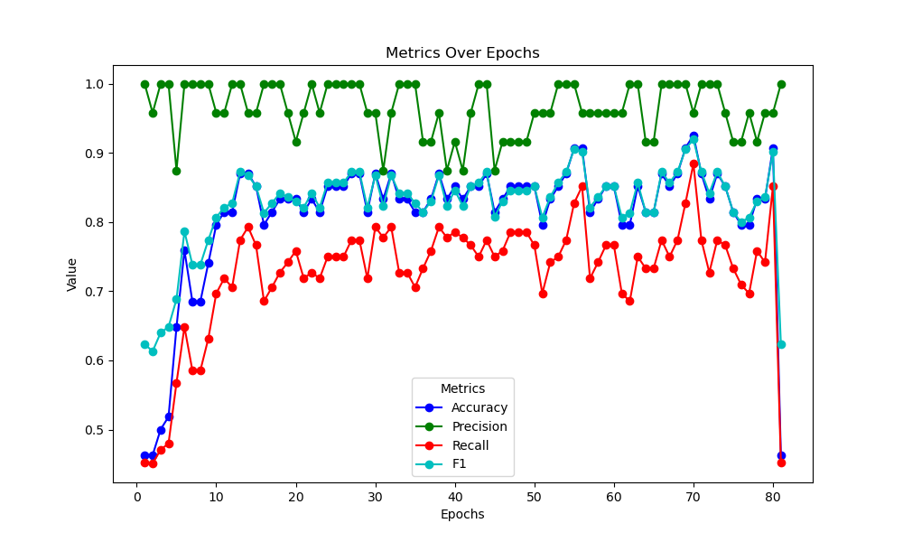
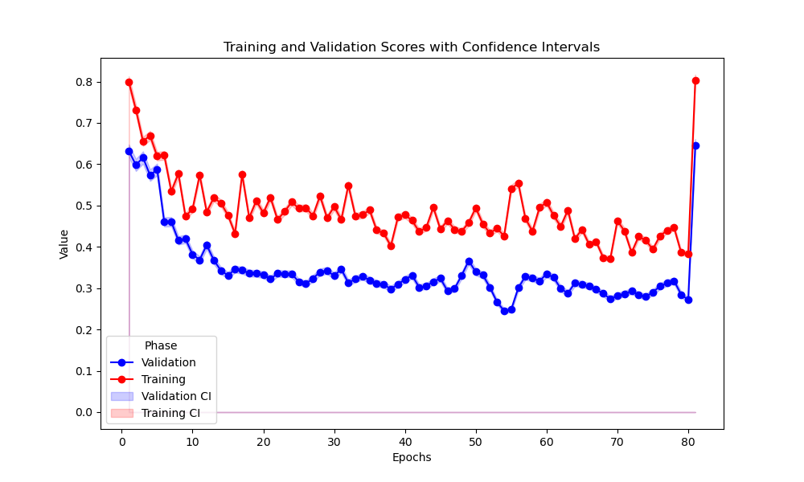

# iPSCs Toolkit (SWE4S - Group 5 Project)

Welcome to the Stem Cells (SC) Toolkit repo <br>
Our goal is that you spend less time worrying about the tedius analysis of cell quantificationa and classification, and more time doing great science! <br>
Here you will find programs that will ease your analysis of iPSCs. Specifically, we worked on tools for iPSCs cell segmentation and classification: <br>
1. **Segmentation**: We leverage of the model created by [CellPose 2.0](https://www.cellpose.org/) and refine it to analyze iPSCs segmentation based on brighfield microscopy.
2. **Classification**: We had develop two convolutional neural network (CNN) models for classification of pluripotent ("good") or differentiated ("bad) iPSCs colonies, imaged using brightfield microscopy.
   1. **VGG**: 
   2. **ResNet**:

## Table of Contents

- [Cell Classification Tool](#cell-classification-tool)
  - [Visual Geometry Group](#visual-geometry-group)

---


## Cell Classification Tool 

### Visual Geometry Group
The goal is to train a machine learning (ML) model that takes in images of induced pluoripotent stem cells (iPSC) colonies and classifies their status based on their differentiation (type of cell they are)

#### Approach
1. **Dataset**: Label dataset of iPSC images categorized by health (contamination and differentiation) status.
   - Publically availible data was used for training from: (Mamaeva et al 2022)
   - This data is in the repository directory entitled `model_data`
   - All data files are 256 x 256 png images and can be used for testing modules. 
      
2. **Preprocessing**: Standardize image sizes, normalize pixel values, and augment dataset to avoid overfitting. Image inputs currently accepted are 256 x 256 pixel png images. 
 - The image preprocessing steps have been tested with this model: 
    - graylevel transform
    - binarization 
    - normalization 
   - histogram equalization

3. **Model**: 
 - A convolutional neural network was trained using publically availible data for the classification of iPSC colonies as healthy or unhealthy. Training was allowed to continue for 80 epochs and 20% of data was witheld and used for validating the model. 
 - This model has been published and was adapted here for implementation as software: Mamaeva, A.; Krasnova, O.; Khvorova, I.; Kozlov, K.; Gursky, V.; Samsonova, M.; Tikhonova, O.; Neganova, I. Quality Control of Human Pluripotent Stem Cell Colonies by Computational Image Analysis Using Convolutional Neural Networks. Int. J. Mol. Sci. 2023, 24, 140. https://doi.org/10.3390/ijms24010140
    
   - Model metrics after training: 
      

      

   - Fine tuning of model can be performed using the `Training.py` module. 
   - To train on your own images simply update the directory path at the top of the module to a directory containing your images. Make sure file named for images contain ground-truth "good" of "bad" annotations (example: name_good.png or name_bad). To initiate training run: 
      ```sh
      python Training.py
      ```
   - To plot training metrics run: 
      ```sh 
      python plot_training_metrics.py
      ```
   - Alternative CNN architectures are provided in `model_architectures.py` and can be adapted into the `training.py` module and the `classify_directory.py` and `classify_image.py` modules

#### Implementation
- Preprocess input images (resizing, normalization).
- Train or fine-tune an ML model on your labeled dataset.
- Develop a function that takes a new image, runs it through the trained model, and returns a health assessment (healthy, undifferentiated, etc.).

- Currently: a binary classifier exists to query the existing model. To run this from the command line cd to the Stemcell_classifier directory and select a pre-trained model. We reccomend Simple_model_best_model_0.92.pt to start. 
- To classify a single image the following can be run in the command line: 
   ```sh
   python classify_image.py --model-path "path_to_your_model.pt" \
                        --image-path "path_to_your_image.png" \
                        --threshold (optional) default = 0.7
   ```
- To classify all images in a directory and get outputs in a csv file, the following can be run in the command line (update with a path to the model and input directory you want: 
   ```sh
   python classify_directory.py --model-path ./models/Simple_model_best_model_0.92.pt \
                           --input-directory ./model_data/H9p36 \
                           --output-file ./classification_results.csv \
                           --threshold 0.625 \
                           --batch-size 64 \
                           --num-workers 0
   ```

### ResNet

#### Classification
This project provides a Python script to analyze images of iPSC (induced pluripotent stem cell) colonies, segment individual colonies using CellPose, and classify them based on their quality (good/bad) using a trained machine learning model.

#### Features

- **Cell Segmentation:** Uses CellPose to accurately segment individual cells within iPSC colonies in microscopic images.
- **Colony Extraction:** Extracts individual colonies from the segmented image.
- **Classification:** Trains a CNN (Convolutional Neural Network) model based on ResNet18 to classify colonies as "good" or "bad".
- **Dataset and DataLoader:** Utilizes PyTorch's `Dataset` and `DataLoader` for efficient data loading and batching.
- **Model Training and Evaluation:** Includes functions for training the model and evaluating its performance on a separate test set.

#### Usage

1. **Prepare your dataset** Organize for training and testing in a directory (in this case `data/`).
2. **Run the script** by using the command
   ```bash
   python tools/ipsc_classification_resnet/ipsc_classifier_resnet50.py
   ```
3. **Output**:
   1. `model_weights.pth` script saved in the working directory (`/Stemcell_segmentation_and_classifier)
   2. **Training loss** displayed in the console shows the values for each epoch during training
   3. **Evaluation metrics** shows in the console the test loss and accuracy after evaluation on the test set 
   
   **Example of output**
   ```bash
   Epoch 1/3, Loss: 0.6751
   Epoch 2/3, Loss: 0.6550
   Epoch 3/3, Loss: 0.6403
   Test Loss: 0.6028, Test Accuracy: 66.88%
   ```

   **Note**: No additional folders or annotated images files are created at the moment but we plan to include these features in future versions of the tool.

#### Implementation
- `load_images()`: Loads images and extracts labels from filenames.
- `ColonySegmenter`: A class for segmenting colonies using CellPose.
- `extract_colonies()`: Extracts individual colonies from the segmented image.
- `ColonyDataset`: A custom Dataset class for loading and preprocessing colony images.
- `data_transforms`: Image transformations for data augmentation and normalization.
- `iPSCClassifier`: A ResNet18-based CNN model for classification.
- `train_model()`: Trains the model using the provided dataloader.
- `evaluate_model()`: Evaluates the trained model on a test dataset

## Cell Segmentation Tool
### Approach
**Background:**
Trophoblasts are the main cell type that compose the placenta. As trophoblasts differentiate, they fuse together to form multinucleated cells. Therefore, a metric to determine the level of differentiation of trophoblasts in culture is the fusion index. Fusion index is calculated across one image frame using this formula:

( total number of nuclei that are present in multinucleated cells - total number of multinucleated cells)/(total number of nuclei)

Thus, the researcher needs to quickly identify nuclei and cell borders. These metrics depend on stain quality and researcher ability to distinguish these features, which can vary by sample and individual. In order to alleviate these biases and issues, we developed a tool to improve cell border identification and count the total number of nuclei. 

### segmentation_cellpose.py

**Purpose:**
The formation of trophoblast cells is quantified by the percentage of multinucleated cells; more cells with multiple nuclei indicate better trophoblast formation. As previously mentioned, immunfluorescent stains can be used to determine cell borders, while DAPI or Hoechst stains are used to observe nuclei. segmentation_cellpose.py streamlines this process by creating a mask of the brightest (border) ACTIN filaments, creating a nuclei mask, and outputting the merged images and total nuclei count. 

1. The ACTIN and DAPI channels are isolated for one rep

2. The ACTIN images are masked to reduce/remove the filaments of lower intensity, and only display the brightest filaments. Performed in FIJI (IMAGEJ) via dapi_actin_merge_macro_ARGS.js

3. The ACTIN mask and DAPI channel images are combined to create hyperstack. Images are saved in new subdirectory. Performed in FIJI (IMAGEJ) via dapi_actin_merge_macro_ARGS.js

4. Cellpose, a cell segmentation machine learning model, segments the DAPI channel of the images and counts the number of total nuclei.

5. The number of nuclei corresponding to each image is put into a dataframe and saved as an excel file in subdirectory.


**Implementation:**

```bash
bash run.sh --parent_directory <path_to_images/> --channel_number <channel> --FIJI_path <path_to_FIJI/> [--thresh_min <value>] [--thresh_max <value>]
```

1. **Arguments:**
   -parent_directory: Directory with images from each treatment and each rep. See directory organizational structure below. 
   -channel_number: Channel to be used for cellpose segmentation 1 = red, 2 = green, 3 = blue. Default set to 1.
   -FIJI_path:  FIJI (IMAGEJ) location on local machine
   -thresh_min: Minimum value for threshold mask. Default set to 5500
   -thresh_max: Maximum value for ACTIN threshold mask. Default set to 10500

2. **User instructions:**
   - Provide a parent directory with the structure below. The dapi and actin files must be named accordingly, with 
   numbers corresponding to the rep numbers
   - The replicates should be grouped by folder.
   - When segmentation_cellpose.py runs the FIJI macro, the user must manually close the files and the program once the macro has completed.

**Parent directory organization**
``` bash
parent_directory/
├── subdir_1/     # Directory 1 for iteration (experimental condition #1)
│   ├── rep_name_DAPI1                       
│   ├── rep_name_ACTIN1             
│   ├── rep_name_DAPI2                         
│   └── rep_name_ACTIN2                       
├── subdir_2     # Directory 2 for iteration (experimental condition #2)
│   ├──rep_name_DAPI1                             
│   ├──rep_name_ACTIN1             
│   ├──rep_name_DAPI2                      
│   └──rep_name_ACTIN2  
└── supplemental images, documents

```
**Output:**
* New subdirectory within the parent directory. 
   * Naming: subdir_1_MASKED
   * Contains:
      * ACTIN mask images merged with the dapi channel. 
      * cellpose segmentation masked images 
      * excel sheet with number of nuclei per image 


### dapi_actin_merge_macro_ARGS.js

**Purpose:**
This file was written as a macro to be called in segmentation_cellpose.py, and used in FIJI/image J. dapi_actin_merge_macro_args contains functions that will identify the corresponding DAPI and ACTIN images within a folder, split each image, threshold the ACTIN image according to the input threshold parameters (thresh_min and thresh_max), and finally merge the blue channel from the DAPI image and the threshold mask of the ACTIN image into one merged image. This new, fully merged image will be saved in a new folder labeled /MASKED. 

Older microscopes store images inefficiently, saving each channel as a separate file. In order to view multiple
channels of the same image, the researcher must open each channel image, split the images, identify the proper
channel from the split images, then merge the correct channels from the separate images. This is highly inefficient,
so adding a macro in FIJI to aid in this process streamlines the image analysis. 

**Requirements:**
* FIJI (IMAGEJ) is required for DAPI_ACTIN_merge_macro_ARGS. Information about downloading FIJI on your local machine can be found here: https://imagej.net/software/FIJI/downloads

* In order for DAPI_ACTIN_merge_macro to function as intended, directories and images require naming specifications:
   * parent directory (any name)
   * subdirectory (any name)
   * images that contain the same name, specify DAPI# or ACTIN# in the name with matching numbers for each replicate
   * images must be in TIFF format for iteration

**Outputs:**
* New subdirectory within the parent directory. 
   * Naming: subdir_1_MASKED
   * Contains:
      * ACTIN mask images merged with the dapi channel. 

## Dependencies

- PyTorch for model building and training.
- OpenCV, PIL, scikitimage for image preprocessing.
- pandas and numpy for data manipulation
- matplotlib

- We reccomend using mamba for package management. 

- An environment can be created using the env.yaml file using mamba by running: 
   ```sh
   mamba env create -f env.yaml
   ```
- Activate the environment with 
   ```sh
   mamba activate env


**Requirements:**
- NumPy (`numpy`)
* pandas
* os
* tifffile
* matplotlib 
* openpyxl
* pathlib
* argparse
* psutil
* subprocess
* cellpose: view cellpose repo for installation information https://github.com/MouseLand/cellpose
* FIJI (IMAGEJ) required for dapi_actin_merge_macro_ARGS. Information about downloading FIJI on your local machine can be found here: https://imagej.net/software/FIJI/downloads

- Python 3.7+
- OpenCV (`cv2`)
- CellPose (`cellpose`)
- PyTorch (`torch`)
- Torchvision (`torchvision`)
- NumPy (`numpy`)
- Pillow (`PIL`)
- Scikit-learn (`sklearn`)

**Installation:**

- Set up the enviroment using the env.yaml file:
```sh
mamba env create -f env.yaml
mamba activate env
```

Alternatenly, use you can do manual installation
```sh
mamba install opencv-python cellpose torch torchvision numpy Pillow scikit-learn pandas matplotlib tifffile openpyxl psutil

```

## Project Structure

### Map

``` bash
SWE4S-GROUP5-PROJECT/
├── data/
│   ├── images.png/                              
├── tools/
│   ├── ipsc_classification_multiple_models/
│   │       ├── results_multiple_models/
│   │          ├── validation_accuracy_all_models.png
│   │          ├── validation_loss_all_models.png
│   │          ├── validation_precision_all_models.png
│   │       ├─- ipsc_classification_multiple_models.py      
│   ├── ipsc_classifier_resnet/     
│   │       ├── results_resnet50/
│   │          ├── trained_model.pth
│   │       ├─- ipsc_classifier_resnet50.py  
│   ├── ipsc_classifier_vgg/              
│   │   ├── classify_directory.py
│   │   ├── classify_image.py 
│   │   ├── model_architectures.ipynb
│   │   ├── plot_training_metrics.py
│   │   ├── Training.py                 
│   ├── tropho_segmentation         
│   │   ├── dapi_actin_merge_macro_ARGS.js
│   │   ├── run.sh
│   │   ├── segmentation_cellpose.py                 
├── .gitignore                            
├── env.yaml                               
├── README.md                             
└── LICENSE                              
```

### Key Directories and Files

- **data/**:  
  Contains input images and related data files. For example, `images.png/` may store sample images used for training or testing the classification or segmentation tools.

- **tools/**:  
  Houses Python scripts and notebooks that train models, evaluate performance, and run segmentation workflows. Each subdirectory corresponds to a particular tool:
  
  - **ipsc_classification_multiple_models/**:
    - `ipsc_classification_multiple_models.py`: Script that trains multiple models (ResNet variants, VGG, AlexNet) on iPSC images and compares their performance.
    - `results_multiple_models/`: Contains plots and results from running multiple models, including:
      - `validation_accuracy_all_models.png`
      - `validation_loss_all_models.png`
      - `validation_precision_all_models.png`
      
  - **ipsc_classifier_resnet/**:
    - `ipsc_classifier_resnet50.py`: Example script that trains a ResNet50 model for classifying iPSC colonies as 'good' or 'bad'.
    - `results_resnet50/`: Stores trained models (`trained_model.pth`) and associated results, such as images showing actual vs predicted label.
    
  - **ipsc_classifier_vgg/**:
    - `classify_directory.py`: Classifies a directory of images using a trained VGG-based model.
    - `classify_image.py`: Classifies a single image using a trained model.
    - `model_architectures.ipynb`: Jupyter notebook exploring different model architectures.
    - `plot_training_metrics.py`: Utility to visualize training and validation metrics.
    - `Training.py`: Script to train a custom CNN model (VGG-like architecture) on iPSC images.
  
  - **tropho_segmentation/**:
    - `dapi_actin_merge_macro_ARGS.js`: Fiji (ImageJ) macro script for merging and thresholding fluorescent channels.
    - `segmentation_cellpose.py`: Uses Cellpose to segment cells in TIFF images after Fiji preprocessing.
    - `run.sh`: A helper bash script that runs the `segmentation_cellpose.py` pipeline, including the Fiji macro and Cellpose segmentation steps.
    
- **env.yaml**:  
  Conda environment file specifying dependencies and versions to recreate the computational environment.


